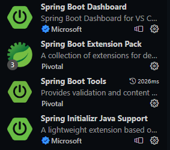
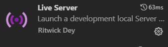

# Fun Flex  

# 

FUN FLEX is an E-Commerce project specialized in the sale of digital entertainment products, such as video games, game consoles, game accessories, movies, music and e-books. We also offer a diverse selection of downloadable digital content and physical products related to entertainment.

## How to Install

- First of all, you need to have jdk 17 version (you can ). We recommend using Microsoft Visual Studio Code as your IDE.
- Then, within Visual Studio Code, you need to download the following Spring Boot extensions:
	- Spring initializr 
	- Spring Boot dashboard 
	- Spring boot tools 
	- Spring Boot Extensión pack

   Also, it is recommended to have the Live Server extension 
   
   
   
   - Now, we must download MySQL Workbench to create our database
	- Once we have established the localhost connection, we must create a database (Schema) called funflexdb
	- the localhost user must be "root" (default user) and must not have a password

## Authors ✒️

* **Andrea Álvarez Posada** - *Developer*
* **Mateo Echeverri Jiménez** - *Developer*
* **Dayron Restrepo Pérez** - *Developer*
* **Andrés Ricardo Villada Marín** - *Developer*
