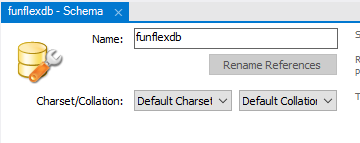

# FunFlex Entertainment  


# <div align=center><a href="#"></a></div>


FunFlex Entertainment is an eCommerce platform offering a wide range of digital entertainment, including movies, music, books, and video games. Its impact lies in facilitating universal access to quality content, promoting the dissemination of art and culture, contributing to environmental sustainability by providing digital media, and supporting the creative industry. The reasons for its existence stem from the growing demand for digital entertainment, the convenience and variety it provides in a single platform, the personalized experience it offers users, and its ability to adapt to current digital trends.

## Table of Contents
1. Introduction
2. Screenshots
3. How to install
4. Technologies Used
5. Resources
6. Authors

## Introduction
FunFlex Entertainment is an innovative eCommerce platform designed to revolutionize how users access and enjoy digital entertainment. Offering a wide variety of multimedia content including movies, music, books, and video games, our platform stands out for its user-friendly interface, personalized recommendations, and commitment to providing diverse and high-quality content. With an extensive library of entertainment options spanning various genres and formats, users can easily explore and discover new favorites.

Our platform provides seamless access to digital entertainment, allowing users to enjoy their favorite media anytime, anywhere, and on any device. Additionally, FunFlex Entertainment enhances the user experience by offering a customer advisory chat feature, enabling users to receive real-time assistance and recommendations from our knowledgeable staff. This fosters a vibrant community of entertainment enthusiasts, offering forums, reviews, and social features to facilitate interaction and discussion. We prioritize the security and privacy of our users, implementing robust measures to ensure secure transactions.

Committed to staying at the forefront of digital entertainment trends, we regularly update our platform with new features and content to enhance the user experience. FunFlex Entertainment redefines how users interact with digital entertainment, offering a comprehensive and immersive platform that caters to the diverse preferences of modern audiences.
## Screenshots


We offer a wide variety of products.


And a customer service chat to resolve your doubts.


## How to Install

- First of all, you need to have jdk 17 version (you can ). We recommend using Microsoft Visual Studio Code as your IDE.
- Then, within Visual Studio Code, you need to download the following Spring Boot extensions:
	- Spring initializr 
	- Spring Boot dashboard 
	- Spring boot tools 
	- Spring Boot Extensión pack


   Also, it is recommended to have the Live Server extension 
   
   
   
   - Now, we must download MySQL Workbench to create our database
	- Once we have established the localhost connection, we must create a database (Schema) called funflexdb
	- the localhost user must be "root" (default user) and must not have a password





- Open the Git Bash console.
- Use the `cd` command to navigate to your desktop and press enter.
```bash
  $ cd Desktop/
```
- Copy and paste the following command to clone the repository from GitHub: `git clone https://github.com/AndresVilladaPoli/FUNFLEX.git`

- Navigate to the frontend directory within the cloned directory.
```bash
  $ cd frontend/
```
- Run the `npm install` command to install Node.js dependencies
```bash
  $ npm install
```
- Then, run the command `npm start` to start the frontend
```bash
  $ npm start
```

    
## Development Approach

We followed the traditional methodology for coding. For the frontend development, we utilized React.js framework, while for the backend, Spring Boot was employed. Additionally, Visual Studio Code was the IDE used for development.


## Resources
We utilized the following resources throughout the project
- [Bootstrap icons](https://icons.getbootstrap.com)
- [Font Awesome](https://fontawesome.com)
- [Font Squirrel](https://www.fontsquirrel.com)
- [Google Fonts API](https://fonts.google.com)


## Authors ✒️

- [Andrea Alvarez Posada](https://github.com/andreaalpo)
- [Dayron Restrepo Perez](https://github.com/DayronR12)
- [Mateo Echeverri Jiménez](https://github.com/Mateo8888)
- [Andrés Ricardo Villada Marín](https://github.com/AndresVilladaPoli)
